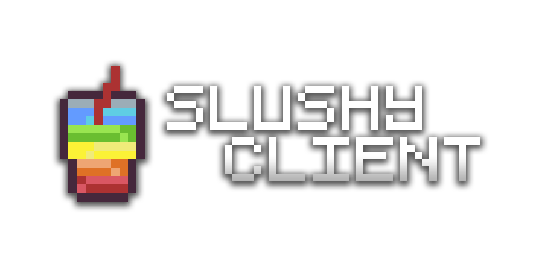

# slushy-client

## A Minecraft PVP Client for the future! Slushy Client works as a Fabric mod to be portable, easy, and open source! 

# Installation
todo

# Mods
- todo
- hax

# Why? 
While current PVP clients are great and all, they tend to require a lot of trust in the company producing the launcher and mods. I think a more minimal, trust-optional solution is necessary. Slushy aims to stay out of your way while giving you helpful utility mods. 

# FAQ (by my mind)

### What versions do you support? 
I'd like to stick to the newest version of the game, but I may support older versions too. At this time, assume 1.19.3 and above! 

### Do you take contributions? 
Of course! Just make sure to create an issue first so nothing gets messed up! 

### Can I use this in my modpack? 
Sure! I don't care about credit, but a link to GitHub would be nice for bug reporting! 

### Do I need an account? 
Nope! And you can't have one, either! Just drop this mod into your mods folder or use [the installer](https://i.imgur.com/o78j8Gc.jpeg). 